# jsxを自力でDOM化してみよう

## はじめに

jsxって便利ですよね。スクリプト内に、タグを書いておけばライブラリ側(ReactやVue)がDOMを生成してくれます。

またTypeScriptと一緒に使うと、属性のチェックまでやってくれます。

こんな便利なjsxなのに、古いWebアプリ(jQuery等)で使われているのを見たことがありません。

そこで、jsx(tsx)をjQueryと組み合わせる方法を模索しました。

* やりたいことは下記のように、文字列で追加するのをやめて、jsxで追加することです(第1章)
```javascript
// jQueryで追加する場合
 $('#app').append('<p><strong>要素の追加テストです。</strong></p>');
```

```javascript
// jsxで追加する場合
 $('#app').append(<p><strong>要素の追加テストです。</strong></p>);
```

* jsxではjsxで型のチェックができないため、tsx化＋タグの型チェックも行います(第2章)

※単にDOM生成をjsxで肩代わりするだけなので、書き換え等はDOMを直接書き換える(jquery使うのと同じ)必要があります

## ①準備

通常、jsxをトランスパイルするためには[babel](https://babeljs.io/)や[TypeScript](https://www.typescriptlang.org/)を利用しますが、
トランスパイル＋実行の手順が少々面倒です。
そこで[babel/standalone](https://babeljs.io/docs/en/babel-standalone)を利用して1つのHTMLファイルのみで実行できるようにします。

* webサーバー不要(htmlファイルをダブルクリックするだけで実行可能))
* TypeScriptやtsxも実行可能


テンプレートhtml (DOM生成関数がないため、エラーになります。この後追加していく)
```html
<!DOCTYPE html>
<head>
  <meta charset="utf-8">
  <title>babel/standaloneでjsxをトランスパイルするテンプレート</title>
  <script src="https://unpkg.com/@babel/standalone/babel.min.js"></script>
  <script>
    // babelでjsxをトランスパイル可能にするため、プライグイン[transform-react-jsx]を
    // 読み込んだプリセット「jsx」を登録します
    Babel.registerPreset('jsx', {
      presets: [
        [Babel.availablePresets['env']]
      ],
      plugins: [
          [Babel.availablePlugins['transform-react-jsx']]
      ],
    });
  </script>

</head>
<body>
  <div id="app"></div>
  <!--
    type="text/babel" ⇒ babelにトランスパイル対象であることを伝える(ブラウザからは無視されます)
    data-presets="jsx" ⇒ 上記で登録したプリセットでトランスパイルします
   -->
  <script type="text/babel" data-presets="jsx" >
    const elements = <p><strong>要素の追加テストです。</strong></p>;
    document.getElementById('app').appendChild(elements);
  </script>
</body>
</html>

```

※テンプレート.htmlを実行すると実行時エラーが発生します(React使っていないのに)

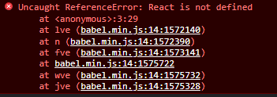


## ②jsxで生成したDOMをjQueryで追加する
①で発生したエラーは、BabelがReactで使われることを想定(デフォルト)されているため発生します。②では設定を変更して、jsxが自作のDOM生成関数を呼び出すようにしてみます

 1. Babelの設定を変更して、jsx変換後の関数を`h()`にする
 1. DOMを生成する関数`h(tagName, props,  ...children)`を作る
 1. jsxからDOMオブジェクトが生成されることを確認する
 1. (おまけ)独自コンポーネントを生成できるように`h()`関数を修正する


### ②-1 babelの設定を変更して、jsx変換後の関数を`h()`にする

jsxをbabelでトランスパイルすると、標準では`React.createElement()`の呼び出しに変換されます。
  ⇒ 今回はReactを使わずに、独自関数を呼び出すようにトランスパイルオプションを変更します

* jsx変換前
```javascript
const dom = <p><strong>要素の追加テストです。</strong></p>;
console.log(dom)
```

* jsx変換後(babelのデフォルト)
```javascript
var dom = /*#__PURE__*/React.createElement("p", null,
            /*#__PURE__*/React.createElement("strong", null, "要素の追加テストです。")
            );
console.log(dom);
```

* 変換後(babel設定変更後)
```javascript
var dom = /*#__PURE__*/h("p", null,
            /*#__PURE__*/h("strong", null, "要素の追加テストです。")
            );
console.log(dom);
```

* `pragma:'h'`：jsxを変換した後の`関数名`を`h()`に変更
* `pragmaFrag: 'div'` ：フラグメント`<> </>`を`<div>`扱いにする(簡単にするため)

設定変更箇所(一部抜粋)
```html
  <script src="https://unpkg.com/@babel/standalone/babel.min.js"></script>
  <script>
    Babel.registerPreset('jsx', {
      presets: [
        [Babel.availablePresets['env']]
      ],
      plugins: [
          [
            Babel.availablePlugins['transform-react-jsx'],
            {pragma:'h', pragmaFrag: '"div"'},　　// 追加
          ]
      ],
    });
  </script>
```

### ②-2 DOMを生成する関数`h(tagName, props,  ...children)`を作る

引数(`タグ`, `属性`, `子要素`)を渡すと、タグを作って返してくれる関数を作ります。

下記のようなイメージです
```js
h('div',{id: 'divid'}, 'text')
//<div id="divid">text</div>
```


DOMに変換する関数仕様（[React.createElement()](https://beta.reactjs.org/reference/react/createElement)とほぼ同じ仕様です)
* h(tag, props, ...children)
  * tag: タグ名
  * props: タグの属性(ex. {id: 'divid'})
  * children: 子要素(文字列、もしくは子タグ)

* jsxからDOMを生成する際、下記ができるようにする
  * classやidなど属性を反映する
  * styleの指定ができる
  * clickなどのイベントが動作する

DOM生成関数
```javascript
function h(tag, props, ...children) {
  // elementを作成
  const elm = document.createElement(tag);
  // 属性を追加
  for (const prop in props) {
    if (prop === 'style') {
      // styleの追加
      for (const s in props[prop]) {
        elm.style[s] = props[prop][s];
      }
    } else if (/^on\w+/.test(prop)) {
      // イベントハンドラの追加
      elm.addEventListener(prop.substring(2), props[prop], false);
    } else {
      // 上記以外の属性を追加
      elm.setAttribute(prop, props[prop]);
    }
  }

  // 子要素の追加
  if (Array.isArray(children)) {
    flatten = children.flat();
    for (const child of flatten) {
      if (typeof child === 'string') {
        // 文字列の場合、TextNodeを追加
        elm.appendChild(document.createTextNode(child));
      } else {
        // 上記以外はNodeをそのまま追加(先に子側が生成され、それが渡される)
        elm.appendChild(child);
      }
    }
  }
  return elm;
}
```

変換サンプル
``` html
・h('div')
   ⇒ <div></div>
・h('div',null, 'text')
   ⇒ <div>text</div>
・h('div',{id: 'divid'}, 'text')
   ⇒ <div id="divid">text</div>
・h('div',{style: {backgroundColor: 'red'}}, 'text')
   ⇒ <div style="background-color: red;">text</div>
・h('div',{style: {'background-color': 'red'}}, 'text', h('span', {}, 'span tag'))
   ⇒ <div style="background-color: red;">text<span>span tag</span></div>
```

### ②-3 jsxからDOMを生成(動作確認)

下記[ソース(step1.html)](./step2-3.html)をブラウザで開くと、jsxからDOMに変換されて表示されます。


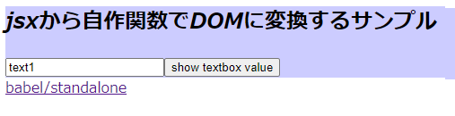

* ブラウザのDevToolで、DOMが想定した通りに生成(属性やstyle)されていることが確認できました
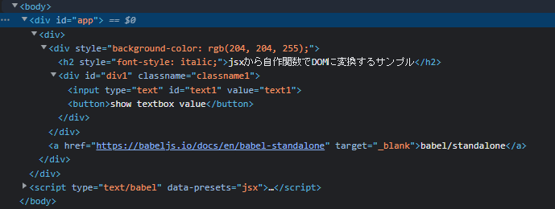

* ボタンのclickイベント(テキストボックスに入力した内容をalert()で表示)も動作しています
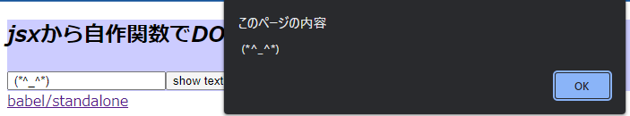

ソース全体(step2-3.html)
```html
<!DOCTYPE html>
<head>
  <meta charset="utf-8">
  <title>jsxを自力でDOM化してみよう</title>
  <script src="https://unpkg.com/@babel/standalone/babel.min.js"></script>
  <script>
    Babel.registerPreset('jsx', {
      presets: [
        [Babel.availablePresets['env']]
      ],
      plugins: [
          [
            Babel.availablePlugins['transform-react-jsx'],
            {pragma:'h', pragmaFrag: '"div"'},
          ]
      ],
    });
  </script>
  <script>
    /**
     * DOMに変換する関数
     * ・React.createElement()や、hyperscript()のようにDOMを生成する関数
     *   tag: タグ名
     *   props: タグの属性
     *   children: 子要素
     * 変換サンプル
     * ・h('div')
     *    ⇒ <div></div>
     * ・h('div',null, 'text')
     *    ⇒ <div>text</div>
     */
     function h(tag, props, ...children) {
      // elementを作成
      const elm = document.createElement(tag);
      // 属性を追加
      for (const prop in props) {
        if (prop === 'style') {
          // styleの追加
          for (const s in props[prop]) {
            elm.style[s] = props[prop][s];
          }
        } else if (/^on\w+/.test(prop)) {
          // イベントハンドラの追加
          elm.addEventListener(prop.substring(2), props[prop], false);
        } else {
          // 上記以外の属性を追加
          elm.setAttribute(prop, props[prop]);
        }
      }

      // 子要素の追加
      if (Array.isArray(children)) {
        flatten = children.flat();
        for (const child of flatten) {
          if (typeof child === 'string') {
            // 文字列の場合、TextNodeを追加
            elm.appendChild(document.createTextNode(child));
          } else {
            // 上記以外はNodeをそのまま追加(先に子側が生成され、それが渡される)
            elm.appendChild(child);
          }
        }
      }
      return elm;
    }
  </script>
</head>
<body>
  <div id="app"></div>
  <script type="text/babel" data-presets="jsx" >
    const elements = (
      <>
        <div style={{ backgroundColor: '#ccf' }}>
          <h2 style={{"font-style":"italic"}}>jsxから自作関数でDOMに変換するサンプル</h2>
          <div id="div1" className="classname1">
            <input type="text" id="text1" value="text1" />
            <button onclick={() => alert(document.getElementById('text1').value)}>
              show textbox value
            </button>
          </div>
        </div>
        <a href="https://babeljs.io/docs/en/babel-standalone" target="_blank">
          babel/standalone
        </a>
      </>
    );
    document.getElementById('app').appendChild(elements);
  </script>
</body>
</html>
```


### ③独自コンポーネント(大文字のタグ)を定義できるようにする
jsxでは独自タグを作ることができます。

jsxはトランスパイルすると、大文字で始まるタグを同名の関数呼び出しに変換してくれます。
```html
  <StrongAnchor href="https://npm.im/hyperscript" target="_blank">
    open hyperscript page
  </StrongAnchor>
```

変換後イメージ(`h()`の引数として、`StrongAnchor`という関数が渡されるようになる)
```javascript
var elements = h(StrongAnchor, {
  href: "https://babeljs.io/docs/en/babel-standalone",
  target: "_blank"
}, "babel/standalone");
```
上記の変換後コードを動かすために、下記の変更を行います
1. (大文字で始まる)タグ名と同じ関数を定義する
1. 関数が`h()`に引き渡された場合、その関数を呼び出す


#### ③-1. (大文字で始まる)タグ名と同じ名前の関数を定義する(DOMオブジェクトを返す)

* 関数の引数は(`props`, `...childlen`)で定義する(タグ名は不要)
* コンポーネントの中でコンポーネントを入れ子にすることもできる

```javascript
    function Strong(props, ...children) {
      return <strong {...props}>{children}</strong>;
    }
    function StrongAnchor(props, ...children) {
      return (
        <Strong>
          <a {...props}>
            【{children}】
          </a>
          ：
          <span style={{"font-style":"italic"}}>Italic</span>
        </Strong>
      );
    }
```

#### ③-2. 関数が`h()`に引き渡された場合、その関数を呼び出すように変更する

tagが関数の場合は、その関数を呼び出す処理を追加します

```javascript
  function h(tag, props, ...children) {
    // ↓ 追加開始
    if (typeof tag === 'function') {
      // 先頭が大文字のタグは関数に変換されるためそのまま呼び出す
      return tag(props, children);
    }
    // ↑ 追加終了

    // ↓以下同じなので省略


    // 子要素の追加
    if (Array.isArray(children)) {
      flatten = children.flat(20); // 追加、入れ子の配列になるので1次元に変換
      for (const child of flatten) {
    // ↓以下同じなので省略
```

* 画面イメージ(step3-1.html)

  &lt;StrongAnchor&gt;が(【】で囲われた太字のリンク＋Itaricの文字)に変換されました。

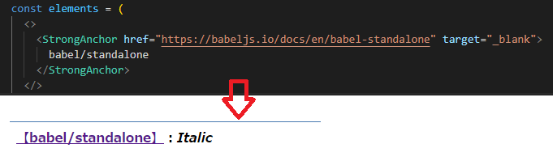

ソース全体(step3-1.html)
```html
<<!DOCTYPE html>
<head>
  <meta charset="utf-8">
  <title>jsxから自作関数でDOMに変換するサンプル(独自コンポーネント追加)</title>
  <script src="https://unpkg.com/@babel/standalone/babel.min.js"></script>
  <script>
    Babel.registerPreset('jsx', {
      presets: [
        [Babel.availablePresets['env']]
      ],
      plugins: [
          [
            Babel.availablePlugins['transform-react-jsx'],
            {pragma:'h', pragmaFrag: '"div"'},
          ]
      ],
    });
  </script>
  <script>
    /**
     * DOMに変換する関数
     * ・React.createElement()や、hyperscript()のようにDOMを生成する関数
     *   tag: タグ名
     *   props: タグの属性
     *   children: 子要素
     * 変換サンプル
     * ・h('div')
     *    ⇒ <div></div>
     * ・h('div',null, 'text')
     *    ⇒ <div>text</div>
     */
     function h(tag, props, ...children) {
      if (typeof tag === 'function') {
        // 先頭が大文字のタグは関数に変換されるためそのまま呼び出す
        return tag(props, children);
      }

      // elementを作成
      const elm = document.createElement(tag);
      // 属性を追加
      for (const prop in props) {
        if (prop === 'style') {
          // styleの追加
          for (const s in props[prop]) {
            elm.style[s] = props[prop][s];
          }
        } else if (/^on\w+/.test(prop)) {
          // イベントハンドラの追加
          elm.addEventListener(prop.substring(2), props[prop], false);
        } else {
          // 上記以外の属性を追加
          elm.setAttribute(prop, props[prop]);
        }
      }

      // 子要素の追加
      if (Array.isArray(children)) {
        // 入れ子の配列を平坦化
        const flatten = children.flat(20);
        for (const child of flatten) {
          if (typeof child === 'object') {
            // Nodeをそのまま追加(先に子側が生成され、それが渡される)
            elm.appendChild(child);
          } else {
            // 文字列の場合、TextNodeを追加
            elm.appendChild(document.createTextNode(child));
          }
        }
      }
      return elm;
    }
  </script>
</head>
<body>
  <div id="app"></div>
  <script type="text/babel" data-presets="jsx" >
    function Strong(props, ...children) {
      return <strong {...props}>{children}</strong>;
    }
    function StrongAnchor(props, ...children) {
      return (
        <Strong>
          <a {...props}>
            【{children}】
          </a>
          ：
          <span style={{"font-style":"italic"}}>Italic</span>
        </Strong>
      );
    }

    const elements = (
      <>
        <StrongAnchor href="https://babeljs.io/docs/en/babel-standalone" target="_blank">
          babel/standalone
        </StrongAnchor>
      </>
    );

    document.getElementById('app').appendChild(elements);
  </script>
</body>
</html>

```


## ④ 属性の型チェックが行えるように設定を変更する

関数やタグ(jsx)の型チェックができるようにするために、TypeScript化(拡張子.tsxのファイル)します。

しかしながらTypeScriptでは**tsxの型指定が用意されていない**ため、属性の候補が表示されません。

（**Reactは、タグの型定義をライブラリ側が提供しているためチェックが行われる**)

* tsxファイル　(型定義がないため属性の候補が表示されない)

  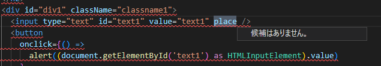

  ⇒ TypeScript化した後で、タグの型定義を別途行います


上記を踏まえて、TypeScript化は下記の順番で行います。

1. babelの設定を変更してTypeScriptをトランスパイルできるようにする
1. スクリプト部分を別ファイルに分離する
1. TypeScriptの設定を追加し、VSCodeでエラーのチェックができるように設定
1. トランスパイラをbabelからTypeScriptに移行する
1. jsxの型定義を行う(interface IntrinsicElements に型定義を追加)

※ 1.はやらなても良いですが、Babel単体でもTypeScriptを扱えることを確認するためにやってみます。

### ④-1 babelの設定を変更してTypeScriptをトランスパイルできるようにする

* TypeScript用プラグイン`transform-typescript`を追加
* jsx構文を有効化(allExtensionsは、isTSX利用時に必要なためセット)
* プリセット名を`tsx`に変更

```html
  <script>
     Babel.registerPreset('tsx', {
      presets: [
        [Babel.availablePresets['env']]
      ],
      plugins: [
        [
          Babel.availablePlugins['transform-typescript'], // TypeScript用プラグイン
          {allExtensions: true, isTSX: true}, // jsx構文を有効化
        ], [
          Babel.availablePlugins['transform-react-jsx'],
          {pragma:'h', pragmaFrag: 'div'},
        ]
      ],
    });
  </script>
  <script type="text/babel" data-presets="tsx"> <!-- プリセット名をtsxに変更 -->
```
上記の変更でTypeScriptが利用可能になります。

しかしTypeScriptのソースががhtml内にあっても、エディタ(VSCode)が正しく認識してくれないため、ソースを別ファイルに分離します。

### ④-2 スクリプトソースを別ファイルに分離する

VSCodeは、htmlの&lt;script&gt;タグ内に書いたソースはJavaScriptとして認識します。
TypeScriptとして認識できるようにするため、別ファイルに分離します。

* これ以降、セキュリティーの問題で、エクスプローラーから直接起動ができなくなります。`npx http-server`等を実行し、Webサーバ経由で表示してください

tsxを含むソースを`step4-2.tsx`ファイルに移動します。
```html
<script type="text/babel" data-presets="tsx" src="step4-2.tsx">
```

htmlのスクリプト(Babelのコンパイル設定以外)を、.tsxファイルに移動します


### ④-3 TypeScriptの設定を追加し、VSCodeでエラーのチェックができるように設定

TypeScriptをインストールして、オプションを設定します。オプション設定により、VSCodeで各種チェックが行わわれるようになります。

(この時点ではまだ、トランスパイラとしてTypeScriptを利用していません。HTML側のbabelがトランスパイル＋実行を行っています。)

```
npm init
npm i -D typescript
touch tsconfig.json
```

直下にtsconfig.jsonファイルを作成し、下記内容を記載します(元がjsなので、緩めに(anyを許可))
```json
{
  "compilerOptions": {
    "lib": ["es2019", "DOM"],
    "target": "ES5",
    "module": "ESNext",
    "strict": true,
    "forceConsistentCasingInFileNames": true,
    "jsx": "react",
    "jsxFactory": "h",
    "jsxFragmentFactory": "JsxFragmentFactory",
    "noImplicitAny": false,
    "strictNullChecks": false
  },
  "exclude": [
    "node_modules"
  ]
}
```
* `"module": "ESNext"`：ESModuleで出力(ブラウザで直接読み込む)
* `"jsx": "react"`：jsxを有効化(関数呼び出しに置き換える)
* `"jsxFactory": "h"`：jsxをh()という関数に置き換える
* `"noImplicitAny": false`：エラー(型指定がない)を回避するため、とりあえず`暗黙のany`を許可
* `"jsxFragmentFactory": "JsxFragmentFactory"`：<>～</>用DOM生成関数の指定(Babelでは"div"を指定していたが、同じ設定ができないため)

``

HTML(step4-3html)
```html
<!DOCTYPE html>
<head>
  <meta charset="utf-8">
  <title>④-3 TypeScriptの設定を追加し、VSCodeでエラーのチェックができるように設定</title>
  <script src="https://unpkg.com/@babel/standalone/babel.min.js"></script>
  <script>
     Babel.registerPreset('tsx', {
      presets: [
        [Babel.availablePresets['env']]
      ],
      plugins: [
        [
          Babel.availablePlugins['transform-typescript'],
          {allExtensions: true, isTSX: true}],
        [
          Babel.availablePlugins['transform-react-jsx'],
          {pragma:'h', pragmaFrag: 'div'},
        ]
      ],
    });
  </script>
</head>
<body>
  <div id="app"></div>
  <script type="text/babel" data-presets="tsx" src="step4-3.tsx"></script>
</body>
</html>

```

* TypeScriptファイルに下記の変更を行います
  * `function hf(props, child)`を追加(Fragmentタグ生成用関数)
  * 型エラーになる箇所の修正`(document.getElementById('text1') as HTMLInputElement).value`

TypeScriptファイル(step4-3.tsx) 参照
```typescript
/**
 * DOMに変換する関数
 * ・React.createElement()や、hyperscript()のようにDOMを生成する関数
 *   tag: タグ名
 *   props: タグの属性
 *   children: 子要素
 * 変換サンプル
 * ・h('div')
 *    ⇒ <div></div>
 * ・h('div',null, 'text')
 *    ⇒ <div>text</div>
 */
function h(tag, props, ...children) {
  if (typeof tag === 'function') {
    // 先頭が大文字のタグは関数に変換されるためそのまま呼び出す
    return tag(props, children);
  }

  // elementを作成
  const elm = document.createElement(tag);
  // 属性を追加
  for (const prop in props) {
    if (prop === 'style') {
      // styleの追加
      for (const s in props[prop]) {
        elm.style[s] = props[prop][s];
      }
    } else if (/^on\w+/.test(prop)) {
      // イベントハンドラの追加
      elm.addEventListener(prop.substring(2), props[prop], false);
    } else {
      // 上記以外の属性を追加
      elm.setAttribute(prop, props[prop]);
    }
  }

  // 子要素の追加
  if (Array.isArray(children)) {
    // 入れ子の配列を平坦化
    const flatten = children.flat(20);
    for (const child of flatten) {
      if (typeof child === 'object') {
        // Nodeをそのまま追加(先に子側が生成され、それが渡される)
        elm.appendChild(child);
      } else {
        // 文字列の場合、TextNodeを追加
        elm.appendChild(document.createTextNode(child));
      }
    }
  }
  return elm;
}

// <>～</>(Fragment)変換用
// tsconfigの「"jsxFragmentFactory": "hf"」で指定した関数
function hf(props, child) {
  <div {...props}>{child}</div>;
}

function Strong(props, ...children) {
  return <strong {...props}>{children}</strong>;
}
function StrongAnchor(props, ...children) {
  return (
    <Strong>
      <a {...props}>【{children}】</a>：
      <span style={{ 'font-style': 'italic' }}>Italic</span>
    </Strong>
  );
}

const elements = (
  <>
    <div style={{ backgroundColor: '#ccf' }}>
      <h2 style={{ 'font-style': 'italic' }}>
        jsxから自作関数でDOMに変換するサンプル
      </h2>
      <div id="div1" className="classname1">
        <input type="text" id="text1" value="text1" place />
        <button
          onclick={() =>
            alert((document.getElementById('text1') as HTMLInputElement).value)
          }
        >
          show textbox value
        </button>
      </div>
    </div>
    <StrongAnchor
      href="https://babeljs.io/docs/en/babel-standalone"
      target="_blank"
    >
      babel/standalone
    </StrongAnchor>
  </>
);

const app: HTMLElement = document.getElementById('app');
app.appendChild(elements);
```

スクリプトを別ファイル(.tsx)に切り出し、VSCode側では`tsconfig.json`の設定を行ったため型チェックが行われるようになりました。(tsxは型定義が存在しないため、エラーだらけになります(後で対応する))

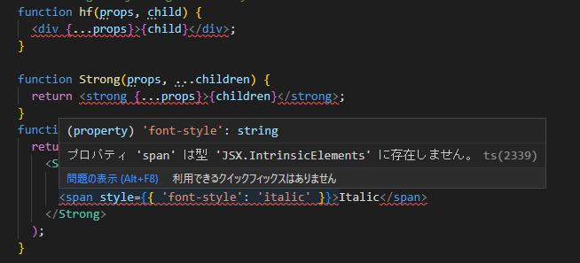


### ④-4 jsxの型定義を行う(interface IntrinsicElements に型定義を追加)

TypeSciprtの設定を行いましたが、tsxには型情報がないため、タグに応じた選択肢が表示されない＋コンパイルができません。


* tsxファイル

  

Reactでは、ライブラリ側が各タグの型情報を提供しているためタグに応じた選択肢が表示されます。
Reactのように全部のタグを正確に定義するのは難しいですが、可能な限り定義してみます。


#### tsxの型定義の仕組み

`interface IntrinsicElements`に「`タグ名 : 型`」を追加することで、TypeScriptが型を認識するようになります

例えば`href`(必須)と`target`(任意)だけ有効な`a`タグの型は下記のようになります。
```typescript
declare global {
  namespace JSX {
    interface IntrinsicElements {
      a: { href: string; target?: '_blank' | '_self' | '_parent' | '_top' };
    }
  }
}
```

定義していない属性はエラーとなるため、`id`属性は指定できません。
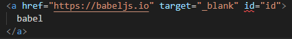


#### htmlのタグ用型定義(&lt;a&gt;タグのみ)

全部の属性を定義するのは大変なので、TypeScriptのDOM定義の型`HTMLAnchorElement`を流用してみます(aタグ全ての属性が定義されている)
```typescript
declare global {
  namespace JSX {
    interface IntrinsicElements {
      a: HTMLAnchorElement;
    }
  }
}
```
すると、大量のエラーが出てしまいました。

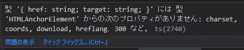


属性の定義に`?`が付いていないためです・・・(属性の省略ができない)


しかし、ここでなんとかできてしまうのがTypeScriptの凄いところです。

[Utility Types](https://typescriptbook.jp/reference/type-reuse/utility-types)という型から別の型を作り出す機能があり、プロパティーを省略可能にできる組み込み機能`Partial<T>`を使えば、全てのプロパティーを省略可能にできてしまいます。

```typescript
interface IntrinsicElements {
  a: Partial<HTMLAnchorElement>;  // 属性を省略可能にする
}
```

ところがPartial<T>ではstyle属性のような、入れ子になっている属性には対応できません。
なので、再帰的に適用する型を別途定義して、そちらを利用するように変更します。

```typescript
export type NestedPartial<T> = {
  [K in keyof T]?: T[K] extends Array<infer R>
    ? Array<NestedPartial<R>>
    : NestedPartial<T[K]>;
};

declare global {
  namespace JSX {
    interface IntrinsicElements {
      a: NestedPartial<HTMLAnchorElement>;
    }
  }
}
```

これで&lt;a&gt;タグの任意の属性を利用、型チェックできるようになりました。

#### htmlのタグ用型定義(全てのタグ)
次は、&lt;a&gt;タグ以外でも利用できるようにしていきます。

下記のように全てのタグを並べれば良いですがスマートではありません。
```typescript
declare global {
  namespace JSX {
    interface IntrinsicElements {
      "a": NestedPartial<HTMLAnchorElement>;
      "abbr": NestedPartial<HTMLElement>;
      "address": NestedPartial<HTMLElement>;
      // ～～ 以下省略 ～～
    }
  }
}
```

TypeScriptの組み込み型定義に、タグと型定義が揃った`HTMLElementTagNameMap`があります。

HTMLElementTagNameMap
```typescript
interface HTMLElementTagNameMap {
  "a": HTMLAnchorElement;
  "abbr": HTMLElement;
  "address": HTMLElement;
  // ～～ 以下省略 ～～
```


最終的には
* IntrinsicElementをHTMLElementTagNameMapから継承します(全ての定義を引き継ぐ)
* 継承する際、各属性を再帰的に省略可能にします(NestedPartial<T>)
* jsxの戻り値をNodeに指定(DOMの基本的な機能を持つ型)

```typescript
type NestedPartial<T> = {
  [K in keyof T]?: T[K] extends Array<infer R>
    ? Array<NestedPartial<R>>
    : NestedPartial<T[K]>;
};

// 各タグの型定義
declare global {
  namespace JSX {
    type Element = Node; // jsxの戻り値をNodeにする(指定しないとanyになる)
    interface IntrinsicElements extends NestedPartial<HTMLElementTagNameMap> {}
  }
}
```

各htmlタグの型定義ができたため、エラーがなくなる＋型の補完が行われるようになりました。

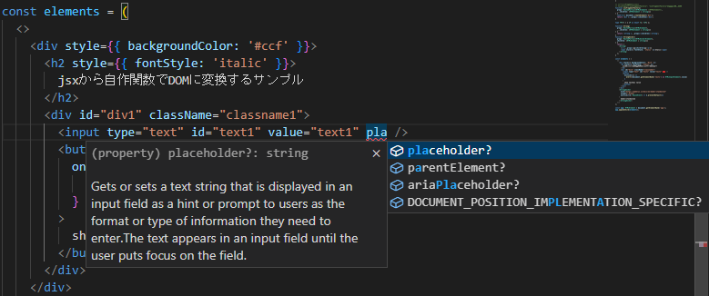

#### ④-5 独自コンポーネントの型定義を行う
独自コンポーネントは、DOM生成関数に型をつけることで型定義ができます。

特定の属性だけを有効にしたい場合は下記のように定義できます
* 属性は`href`(文字列、必須)と、`target`(任意、_blank, _self, _parent, _topのいずれか)
* 上記以外の属性はエラーになる
* 子要素は、htmlのタグ、もしくは文字列の配列

```typescript
function StrongAnchor(
  props: { href: string; target?: '_blank' | '_self' | '_parent' | '_top' },
  child: (HTMLElement | string)[]
): HTMLElement {
  // 省略
}
```

`&lt;a&gt;`タグの全ての属性を利用可能にするのであれば、下記のように定義できます。

```typescript
function StrongAnchor(
  props: NestedPartial<HTMLAnchorElement>,
  children: (HTMLElement | string)[]
) {
  // 省略
}
```

### ④-5 トランスパイラをbabelからTypeScriptに移行する

型定義ができれば、TypeScript側でトランスパイルができるようになるため移行します。

1．htmlファイルから、Babelを削除する
```html
<!DOCTYPE html>
<head>
  <meta charset="utf-8">
  <title>③-5 トランスパイラをbabelからTypeScriptに移行する</title>
</head>
<body>
  <div id="app"></div>
  <script type="text/babel" data-presets="tsx" src="step4-5.tsx"></script>
</body>
</html>
```

2. tscでトランスパイルを行い、生成されたjavascriptファイルをhtmlで読み込む
  * ESModuleを読み込むため、`type="module"`を追加
  * src指定をトランスパイル後のjsファイルに変更

```html
<!-- 変更前 -->
<script type="text/babel" data-presets="tsx" src="step4-5.tsx"></script>

<!-- 変更後 -->
<script type="module" src="step4-5.js"></script>
```

htmlを表示すると、Babelで実行していた場合と同じ画面が表示されるようになります。
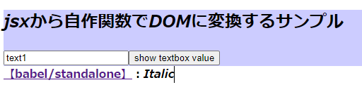


## ⑤ 全て1スクリプトファイルに詰め込んでいたのを、分割して再利用可能にする

スクリプトファイルを機能ごとにファイル分割します。
* 型定義
* DOM生成関数
* 独自コンポーネント
* 画面(のjsx定義)

step5.html
```html
<!DOCTYPE html>
<head>
  <meta charset="utf-8">
  <title>⑤ 全て1スクリプトファイルに詰め込んでいたのを、分割して再利用可能にする</title>
</head>
<body>
  <div id="app"></div>
  <script type="module" src="step5.js"></script>
</body>
</html>
```

型定義(jsx-global.d.ts)
```typescript
// 属性を再帰的に省略可能にするユーティリティー
export type NestedPartial<T> = {
  [K in keyof T]?: T[K] extends Array<infer R>
    ? Array<NestedPartial<R>>
    : NestedPartial<T[K]>;
};

// jsxの型定義
declare global {
  namespace JSX {
    type Element = Node;
    interface IntrinsicElements extends NestedPartial<HTMLElementTagNameMap> {}
  }
}
```

DOM生成関数(dom-generator.tsx)
```typescript
import { NestedPartial } from 'jsx-global';
/**
 * DOMに変換する関数
 * ・React.createElement()や、hyperscript()のようにDOMを生成する関数
 *   tag: タグ名
 *   props: タグの属性
 *   children: 子要素
 * 変換サンプル
 * ・h('div')
 *    ⇒ <div></div>
 * ・h('div',null, 'text')
 *    ⇒ <div>text</div>
 */
export function h(tag, props, ...children) {
  if (typeof tag === 'function') {
    // 先頭が大文字のタグは関数に変換されるためそのまま呼び出す
    return tag(props, children);
  }

  // elementを作成
  const elm = document.createElement(tag);
  // 属性を追加
  for (const prop in props) {
    if (prop === 'style') {
      // styleの追加
      for (const s in props[prop]) {
        elm.style[s] = props[prop][s];
      }
    } else if (/^on\w+/.test(prop)) {
      // イベントハンドラの追加
      elm.addEventListener(prop.substring(2), props[prop], false);
    } else {
      // 上記以外の属性を追加
      elm.setAttribute(prop, props[prop]);
    }
  }

  // 子要素の追加
  if (Array.isArray(children)) {
    // 入れ子の配列を平坦化
    const flatten = children.flat(20);
    for (const child of flatten) {
      if (typeof child === 'object') {
        // Nodeをそのまま追加(先に子側が生成され、それが渡される)
        elm.appendChild(child);
      } else {
        // 文字列の場合、TextNodeを追加
        elm.appendChild(document.createTextNode(child));
      }
    }
  }
  return elm;
}

// <>～</>(Fragment)変換用
// tsconfigの「"jsxFragmentFactory": "JsxFragmentFactory"」で指定した関数
export function JsxFragmentFactory(
  props: NestedPartial<HTMLElement> /*HTMLElement*/,
  ...children: (HTMLElement | string)[]
) {
  const d = document.createElement('div');
  return <div {...props}>{children}</div>;
}
```

Strong.tsx
```typescript
import { NestedPartial } from './jsx-global.js';
import { h } from './dom-generator.js';

export function Strong(
  props: NestedPartial<HTMLElement>,
  ...children: (HTMLElement | string)[]
) {
  return <strong {...props}>{children}</strong>;
}

```

StrongAnchor.tsx
```typescript
import { NestedPartial } from './jsx-global.js';
import { h } from './dom-generator.js';
import { Strong } from './Strong.js';

export function StrongAnchor(
  props: NestedPartial<HTMLAnchorElement>,
  children: (HTMLElement | string)[]
) {
  return (
    <Strong>
      <a {...props}>【{children}】</a>：
      <span style={{ fontStyle: 'italic' }}>Italic</span>
    </Strong>
  );
}
```


step5.html
```html
<!DOCTYPE html>
<head>
  <meta charset="utf-8">
  <title>⑤ 全て1スクリプトファイルに詰め込んでいたのを、分割して再利用可能にする</title>
</head>
<body>
  <div id="app"></div>
  <script type="module" src="step5.js"></script>
</body>
</html>
```

## ⑥ ボタンクリックでカウントアップする簡単なサンプル
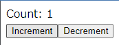

Reactのように、DOMを再描画する機能はないので下記のように書き換えます(jquery等で書きかえるのと原理的に同じです)
* ①jsxで生成したDOMを直接書き換える
* ②DOMを置き換える

step6.tsx
```typescript
import { h, JsxFragmentFactory } from './dom-generator.js';

document.addEventListener('DOMContentLoaded', (event) => {
  let count = 0;
  let Counter = (<div>Count: {count}</div>) as HTMLDivElement;
  // ①内部のTextを書き換える
  const handleInc = () => {
    Counter.innerText = `Count: ${++count}`;
  };

  const elements = (
    <>
      {Counter}
      <button onclick={handleInc}>Increment</button>
      <button onclick={handleDec}>Decrement</button>
    </>
  );

  // ②新しい<div>タグを作り、元と入れ替える
  function handleDec() {
    const replace = (<div>Count: {--count}</div>) as HTMLDivElement;
    elements.replaceChild(replace, Counter);
    Counter = replace;
  }

  const app: HTMLElement = document.getElementById('app');
  app.appendChild(elements);
});
```
