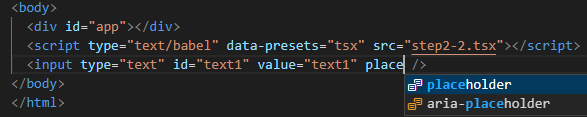

# jsxを自作関数でDOM化するサンプル

## はじめに

jsxを使う際、通常はライブラリ側(ReactやVue)がDOMを生成してくれます。
またTypeScriptと組み合わせると、型のチェックが行われることでとても良い開発者体験が得られます。

しかし古いWebアプリ(jQuery)では、Reactなどを組み合わせるが困難です。
そこで、jsx(tsx)をjQueryと組み合わせる方法を模索しました。

* やりたいことは下記のように、文字列で追加するのをやめて、jsxで追加することです(第1章)
```javascript
// jQueryで追加する場合
 $('#app').append('<p><strong>要素の追加テストです。</strong></p>');
```

```javascript
// jsxで追加する場合
 $('#app').append(<p><strong>要素の追加テストです。</strong></p>);
```

* jsxではjsxで型のチェックができないため、tsx化＋タグの型チェックも行います(第2章)


## 準備

通常、jsxをトランスパイルするためには[babel](https://babeljs.io/)や[TypeScript](https://www.typescriptlang.org/)を利用しますが、
トランスパイル＋実行の手順が少々面倒です。そこで[babel/standalone](https://babeljs.io/docs/en/babel-standalone)を利用して1つのHTMLファイルのみで実行できるようにします。

(webサーバーも不要です(htmlファイルをダブルクリックするだけで実行可能))

* ただし、下記html(のスクリプト)は実行エラーになります。jsxはReact.createElement()の呼び出しに変換されます(babelのデフォルト)が、関数が定義されていないためです。

テンプレートhtml
```html
<!DOCTYPE html>
<head>
  <meta charset="utf-8">
  <title>babel/standaloneでjsxをトランスパイルするテンプレート</title>
  <script src="https://unpkg.com/@babel/standalone/babel.min.js"></script>
  <script>
    // babelでjsxをトランスパイル可能にするため、プライグイン[transform-react-jsx]を
    // 読み込んだプリセット「jsx」を登録します
    Babel.registerPreset('jsx', {
      presets: [
        [Babel.availablePresets['env']]
      ],
      plugins: [
          [Babel.availablePlugins['transform-react-jsx']]
      ],
    });
  </script>

</head>
<body>
  <div id="app"></div>
  <!--
    type="text/babel" ⇒ babelにトランスパイル対象であることを伝える(ブラウザからは無視されます)
    data-presets="jsx" ⇒ 上記で登録したプリセットでトランスパイルします
   -->
  <script type="text/babel" data-presets="jsx" >
    const elements = <p><strong>要素の追加テストです。</strong></p>;
    document.getElementById('app').appendChild(elements);
  </script>
</body>
</html>

```

## ① jsxで生成したDOMをjQueryで追加する

 1. babelの設定を変更して、jsx変換後の関数を`h()`にする
 1. DOMを生成する関数`h(tagName, props,  ...children)`を作る
 1. jsxからDOMを生成し動作確認
 1. (おまけ)独自コンポーネントを生成できるように`h()`関数を修正する


### ①-1 babelの設定を変更して、jsx変換後の関数を`h()`にする

jsxをbabelでトランスパイルすると、標準では`React.createElement()`の呼び出しに変換されます。
  ⇒ Reactが読み込まれていないと実行ができないため、トランスパイルオプションを変更します

* 変換前
```javascript
const dom = <p><strong>要素の追加テストです。</strong></p>;
console.log(dom)
```

* 変換後(babel)
```javascript
var dom = /*#__PURE__*/React.createElement("p", null,
            /*#__PURE__*/React.createElement("strong", null, "要素の追加テストです。")
            );
console.log(dom);
```

* 変換後(babel設定変更後)
```javascript
var dom = /*#__PURE__*/h("p", null,
            /*#__PURE__*/h("strong", null, "要素の追加テストです。")
            );
console.log(dom);
```

* `pragma:'h'`：jsxを変換した後の`関数名`を`h()`に変更
* `pragmaFrag: 'div'` ：フラグメント`<> </>`を`<div>`扱いにする

```html
  <script src="https://unpkg.com/@babel/standalone/babel.min.js"></script>
  <script>
    Babel.registerPreset('jsx', {
      presets: [
        [Babel.availablePresets['env']]
      ],
      plugins: [
          [
            Babel.availablePlugins['transform-react-jsx'],
            {pragma:'h', pragmaFrag: 'div'},　　// 追加
          ]
      ],
    });
  </script>
```

### ①-2 DOMを生成する関数`h(tagName, props,  ...children)`を作る

独自のDOM生成関数を作ります。（React.createElement()や、hyperscript()のようにDOMを生成する関数）

DOMに変換する関数仕様

* h(tag, props, ...children)
  * tag: タグ名
  * props: タグの属性(ex. {id: 'divid'})
  * children: 子要素(文字列、もしくは子タグ)

* jsxからDOMを生成して画面に表示し、下記を確認する
  * classやidなど属性が反映されていること
  * styleが反映されること
  * clickなどのイベントが動作すること

DOM生成関数
```javascript
function h(tag, props, ...children) {
  // elementを作成
  const elm = document.createElement(tag);
  // 属性を追加
  for (const prop in props) {
    if (prop === 'style') {
      // styleの追加
      for (const s in props[prop]) {
        elm.style[s] = props[prop][s];
      }
    } else if (/^on\w+/.test(prop)) {
      // イベントハンドラの追加
      elm.addEventListener(prop.substring(2), props[prop], false);
    } else {
      // 上記以外の属性を追加
      elm.setAttribute(prop, props[prop]);
    }
  }

  // 子要素の追加
  if (Array.isArray(children)) {
    flatten = children.flat();
    for (const child of flatten) {
      if (typeof child === 'string') {
        // 文字列の場合、TextNodeを追加
        elm.appendChild(document.createTextNode(child));
      } else {
        // 上記以外はNodeをそのまま追加(先に子側が生成され、それが渡される)
        elm.appendChild(child);
      }
    }
  }
  return elm;
}
```


変換サンプル
``` html
・h('div')
   ⇒ <div></div>
・h('div',null, 'text')
   ⇒ <div>text</div>
・h('div',{id: 'divid'}, 'text')
   ⇒ <div style="color: red;">text</div>
・h('div',{style: {backgroundColor: 'red'}}, 'text')
   ⇒ <div style="background-color: red;">text</div>
・h('div',{style: {'background-color': 'red'}}, 'text', h('span', {}, 'span tag'))
   ⇒ <div style="background-color: red;">text<span>span tag</span></div>
```

### ①-3 jsxからDOMを生成(動作確認)

下記[ソース(step1.html)](./step1.html)をブラウザで開くと、jsxからDOMに変換されて表示されます。

* styleやイベントハンドラ(onclick)も動作しています


ソース全体(step1-3.html)
```html
<!DOCTYPE html>
<head>
  <meta charset="utf-8">
  <title>jsxから自作関数でDOMに変換するサンプル</title>
  <script src="https://unpkg.com/@babel/standalone/babel.min.js"></script>
  <script>
    Babel.registerPreset('jsx', {
      presets: [
        [Babel.availablePresets['env']]
      ],
      plugins: [
          [
            Babel.availablePlugins['transform-react-jsx'],
            {pragma:'h', pragmaFrag: 'div'},
          ]
      ],
    });
  </script>
  <script>
    /**
     * DOMに変換する関数
     * ・React.createElement()や、hyperscript()のようにDOMを生成する関数
     *   tag: タグ名
     *   props: タグの属性
     *   children: 子要素
     * 変換サンプル
     * ・h('div')
     *    ⇒ <div></div>
     * ・h('div',null, 'text')
     *    ⇒ <div>text</div>
     */
     function h(tag, props, ...children) {
      // elementを作成
      const elm = document.createElement(tag);
      // 属性を追加
      for (const prop in props) {
        if (prop === 'style') {
          // styleの追加
          for (const s in props[prop]) {
            elm.style[s] = props[prop][s];
          }
        } else if (/^on\w+/.test(prop)) {
          // イベントハンドラの追加
          elm.addEventListener(prop.substring(2), props[prop], false);
        } else {
          // 上記以外の属性を追加
          elm.setAttribute(prop, props[prop]);
        }
      }

      // 子要素の追加
      if (Array.isArray(children)) {
        for (const child of flatten) {
          if (typeof child === 'string') {
            // 文字列の場合、TextNodeを追加
            elm.appendChild(document.createTextNode(child));
          } else {
            // 上記以外はNodeをそのまま追加(先に子側が生成され、それが渡される)
            elm.appendChild(child);
          }
        }
      }
      return elm;
    }
  </script>
</head>
<body>
  <div id="app"></div>
  <script type="text/babel" data-presets="jsx" >
    const elements = (
      <>
        <div style={{ backgroundColor: '#ccf' }}>
          <h2 style={{"font-style":"italic"}}>jsxから自作関数でDOMに変換するサンプル</h2>
          <div id="div1" className="classname1">
            <input type="text" id="text1" value="text1" />
            <button onclick={() => alert(document.getElementById('text1').value)}>
              show textbox value
            </button>
          </div>
        </div>
        <a href="https://npm.im/hyperscript" target="_blank">
          open hyperscript page
        </a>
      </>
    );

    document.getElementById('app').appendChild(elements);
  </script>
</body>
</html>
```
### ①-4 (おまけ)独自コンポーネントを生成できるように`h()`関数を修正する
jsxでは独自にタグを作ることができます。
jsxはトランスパイルすると、大文字で始まるタグを同名の関数呼び出しに変換します。
```html
  <StrongAnchor href="https://npm.im/hyperscript" target="_blank">
    open hyperscript page
  </StrongAnchor>
```


#### 1. タグと同じ名前の関数を定義して、DOMオブジェクトを返します(独自コンポーネント)

コンポーネントの中でコンポーネントを入れ子にすることができます。

```javascript
  function StrongAnchor(props, child) {
    return (
      <Strong>
          <a {...props}>
            【{child}】
          </a>
      </Strong>
    );
  }
  function Strong(props, child) {
    return <strong {...props}>{child}</strong>;
  }
```

#### 2. jsxは同名の関数オブジェクトに変換して`h(tag, props, children)`に引き渡します。
tagに関数オブジェクトが入っているため、`h()`関数を少し修正します。

```javascript
  function h(tag, props, ...children) {
    // ↓ 追加開始
    if (typeof tag === 'function') {
      // 先頭が大文字のタグは関数に変換されるためそのまま呼び出す
      return tag(props, children);
    }
    // ↑ 追加終了

    // ↓以下同じなので省略


    // 子要素の追加
    if (Array.isArray(children)) {
      flatten = children.flat(20); // 追加、入れ子の配列になるので1次元に変換
      for (const child of flatten) {
    // ↓以下同じなので省略
```

* 画面イメージ(step1-4.html)

  独自コンポーネント(太字のリンク＋【】で囲う)が描画されています。


ソース全体
```html
<!DOCTYPE html>
<head>
  <meta charset="utf-8">
  <title>jsxから自作関数でDOMに変換するサンプル(独自コンポーネント追加)</title>
  <script src="https://unpkg.com/@babel/standalone/babel.min.js"></script>
  <script>
    Babel.registerPreset('jsx', {
      presets: [
        [Babel.availablePresets['env']]
      ],
      plugins: [
          [
            Babel.availablePlugins['transform-react-jsx'],
            {pragma:'h', pragmaFrag: 'div'},
          ]
      ],
    });
  </script>
  <script>
    /**
     * DOMに変換する関数
     * ・React.createElement()や、hyperscript()のようにDOMを生成する関数
     *   tag: タグ名
     *   props: タグの属性
     *   children: 子要素
     * 変換サンプル
     * ・h('div')
     *    ⇒ <div></div>
     * ・h('div',null, 'text')
     *    ⇒ <div>text</div>
     */
     function h(tag, props, ...children) {
      if (typeof tag === 'function') {
        // 先頭が大文字のタグは関数に変換されるためそのまま呼び出す
        return tag(props, children);
      }

      // elementを作成
      const elm = document.createElement(tag);
      // 属性を追加
      for (const prop in props) {
        if (prop === 'style') {
          // styleの追加
          for (const s in props[prop]) {
            elm.style[s] = props[prop][s];
          }
        } else if (/^on\w+/.test(prop)) {
          // イベントハンドラの追加
          elm.addEventListener(prop.substring(2), props[prop], false);
        } else {
          // 上記以外の属性を追加
          elm.setAttribute(prop, props[prop]);
        }
      }

      // 子要素の追加
      if (Array.isArray(children)) {
        // 入れ子の配列を平坦化
        flatten = children.flat(20);
        for (const child of flatten) {
          if (typeof child === 'string') {
            // 文字列の場合、TextNodeを追加
            elm.appendChild(document.createTextNode(child));
          } else {
            // 上記以外はNodeをそのまま追加(先に子側が生成され、それが渡される)
            elm.appendChild(child);
          }
        }
      }
      return elm;
    }
  </script>
</head>
<body>
  <div id="app"></div>
  <script type="text/babel" data-presets="jsx" >
    function Strong(props, child) {
      return <strong {...props}>{child}</strong>;
    }
    function StrongAnchor(props, child) {
      return (
        <Strong>
          <a {...props}>
            【{child}】
          </a>
        </Strong>
      );
    }

    const elements = (
      <>
        <div style={{ backgroundColor: '#ccf' }}>
          <h2 style={{"font-style":"italic"}}>jsxから自作関数でDOMに変換するサンプル</h2>
          <div id="div1" className="classname1">
            <input type="text" id="text1" value="text1" />
            <button onclick={() => alert(document.getElementById('text1').value)}>
              show textbox value
            </button>
          </div>
        </div>
        <StrongAnchor href="https://babeljs.io/docs/en/babel-standalone" target="_blank">
          babel/standalone
        </StrongAnchor>
      </>
    );

    document.getElementById('app').appendChild(elements);
  </script>
</body>
</html>
```


## ② TypeScript化を行い、tsxで型チェックができるようにする

TypeScript化は下記の順番に行います。

1. babelの設定を変更してTypeScriptをコンパイルできるようにする
1. スクリプト部分を別ファイルに分離する
1. TypeScriptの設定を追加し、VSCodeでエラーのチェックができるように設定
1. トランスパイらをbabelからTypeScriptに移行する
1. jsxの型定義を行う(interface IntrinsicElements に型定義を追加)


### ②-1 babelの設定を変更してTypeScriptをコンパイルできるようにする

* TypeScript用プラグイン`transform-typescript`を追加
* jsx構文を有効化(allExtensionsは、isTSX利用時に必要なためセット)
* プリセット名を`tsx`に変更

```html
  <script>
     Babel.registerPreset('tsx', {
      presets: [
        [Babel.availablePresets['env']]
      ],
      plugins: [
        [
          Babel.availablePlugins['transform-typescript'], // TypeScript用プラグイン
          {allExtensions: true, isTSX: true}, // jsx構文を有効化
        ], [
          Babel.availablePlugins['transform-react-jsx'],
          {pragma:'h', pragmaFrag: 'div'},
        ]
      ],
    });
  </script>
  <script type="text/babel" data-presets="tsx"> <!-- プリセット名をtsxに変更 -->
```


### ②-2 スクリプト部分を別ファイルに分離する

VSCodeは、htmlの&lt;script&gt;タグ内に書いたJavaScriptを認識してサポートしてくれます。
しかし、TypeScriptの型などは認識してくれないため、別ファイルに分離します。

* セキュリティーの問題で、エクスプローラーから直接起動ができなくなります。`npx http-server`等を実行し、Webサーバ経由で表示してください

```html
<script type="text/babel" data-presets="tsx" src="step2-2.tsx">
```

htmlのスクリプト(Babelのコンパイル設定以外)を、.tsxファイルに移動します


### ②-3 TypeScriptの設定を追加し、VSCodeでエラーのチェックができるように設定

TypeScriptをインストールして、オプションを設定します。オプション設定により、VSCodeで各種チェックが行わわれるようになります。

(この時点では、トランスパイラとしてTypeScriptを利用しません。HTML側のbabelがトランスパイルを行っています)

```
npm init
npm i -D typescript
touch tsconfig.json
```

直下にtsconfig.jsonファイルを作成し、下記内容を記載します
```json
{
  "compilerOptions": {
    "lib": ["es2019", "DOM"],
    "target": "ES5",
    "module": "CommonJS",
    "strict": true,
    "esModuleInterop": true,
    "forceConsistentCasingInFileNames": true,
    "jsx": "react",
    "jsxFactory": "h",
    "jsxFragmentFactory": "hf",
    "noImplicitAny": false,
    "strictNullChecks": false
  },
  "exclude": [
    "node_modules"
  ]
}
```
* `"jsx": "react"`：jsxを有効化
* `"jsxFactory": "h"`：jsxのコンパイル結果をh()という関数に置き換え
* `"noImplicitAny": false`：エラー(型指定がない)を回避するため、とりあえず`暗黙のany`を許可
* `"jsxFragmentFactory": "hf"`：<>～</>用DOM生成関数

``

HTML(step2-2.html)
```html
<!DOCTYPE html>
<head>
  <meta charset="utf-8">
  <title>jsxから自作関数でDOMに変換するサンプル(TypeScript外部ファイル化)</title>
  <script src="https://unpkg.com/@babel/standalone/babel.min.js"></script>
  <script>
     Babel.registerPreset('tsx', {
      presets: [
        [Babel.availablePresets['env']]
      ],
      plugins: [
        [
          Babel.availablePlugins['transform-typescript'],
          {allExtensions: true, isTSX: true}],
        [
          Babel.availablePlugins['transform-react-jsx'],
          {pragma:'h', pragmaFrag: 'div'},
        ]
      ],
    });
  </script>
</head>
<body>
  <div id="app"></div>
  <script type="text/babel" data-presets="tsx" src="step2-2.tsx"></script>
</body>
</html>

```

* TypeScriptファイルに下記の変更を行います
  * `function hf(props, child)`を追加
  * 型エラーになる箇所の修正`(document.getElementById('text1') as HTMLInputElement).value`

TypeScriptファイル(step2-2.tsx)
```typescript
/**
 * DOMに変換する関数
 * ・React.createElement()や、hyperscript()のようにDOMを生成する関数
 *   tag: タグ名
 *   props: タグの属性
 *   children: 子要素
 * 変換サンプル
 * ・h('div')
 *    ⇒ <div></div>
 * ・h('div',null, 'text')
 *    ⇒ <div>text</div>
 */
function h(tag, props, ...children) {
  if (typeof tag === 'function') {
    // 先頭が大文字のタグは関数に変換されるためそのまま呼び出す
    return tag(props, children);
  }

  // elementを作成
  const elm = document.createElement(tag);
  // 属性を追加
  for (const prop in props) {
    if (prop === 'style') {
      // styleの追加
      for (const s in props[prop]) {
        elm.style[s] = props[prop][s];
      }
    } else if (/^on\w+/.test(prop)) {
      // イベントハンドラの追加
      elm.addEventListener(prop.substring(2), props[prop], false);
    } else {
      // 上記以外の属性を追加
      elm.setAttribute(prop, props[prop]);
    }
  }

  // 子要素の追加
  if (Array.isArray(children)) {
    // 入れ子の配列を平坦化
    const flatten = children.flat(20);
    for (const child of flatten) {
      if (typeof child === 'string') {
        // 文字列の場合、TextNodeを追加
        elm.appendChild(document.createTextNode(child));
      } else {
        // 上記以外はNodeをそのまま追加(先に子側が生成され、それが渡される)
        elm.appendChild(child);
      }
    }
  }
  return elm;
}

// <>～</>(Fragment)変換用
// tsconfigの「"jsxFragmentFactory": "hf"」で指定した関数
function hf(props, child) {
  <div {...props}>{child}</div>;
}

function Strong(props, child) {
  return <strong {...props}>{child}</strong>;
}
function StrongAnchor(props, child) {
  return (
    <Strong>
      <a {...props}>【{child}】</a>
    </Strong>
  );
}

const elements = (
  <>
    <div style={{ backgroundColor: '#ccf' }}>
      <h2 style={{ 'font-style': 'italic' }}>
        jsxから自作関数でDOMに変換するサンプル
      </h2>
      <div id="div1" className="classname1">
        <input type="text" id="text1" value="text1" />
        <button
          onclick={() =>
            alert((document.getElementById('text1') as HTMLInputElement).value)
          }
        >
          show textbox value
        </button>
      </div>
    </div>
    <StrongAnchor
      href="https://babeljs.io/docs/en/babel-standalone"
      target="_blank"
    >
      babel/standalone
    </StrongAnchor>
  </>
);

const app: HTMLElement = document.getElementById('app');
app.appendChild(elements);
```
### ②-4 トランスパイらをbabelからTypeScriptに移行する
### ②-5 jsxの型定義を行う(interface IntrinsicElements に型定義を追加)

②-3の時点でtsxファイルをトランスパイルして実行できていますが、TypeScript側では
tsx部分の型情報がないため、入力の補助ができていません。

下記のように、タグに応じた選択肢が表示されていない状態になっています。
* htmlファイル


* tsxファイル


例えばReactでは、ライブラリ側が各タグの型情報を提供しているためタグに応じた選択肢が表示されます。
使い勝手をよくするため、タグに応じた型情報を定義します。


#### 独自コンポーネント用型定義
独自コンポーネントは、DOM生成関数に型をつけることで型定義ができます。
* 属性は`href`(文字列、必須)と、`target`(任意、_blank, _self, _parent, _topのいずれか)
* 上記以外の属性はエラーになる
* 子要素は、htmlのタグ、もしくは文字列の配列

```typescript
function StrongAnchor(
  props: { href: string; target?: '_blank' | '_self' | '_parent' | '_top' },
  child: (HTMLElement | string)[]
): HTMLElement {
  // 省略
}
```

#### tsxの型定義の仕組み

`interface IntrinsicElements`に「`タグ名 : 型`」を追加することで、TypeScriptが型を認識するようになります

```
interface IntrinsicElements {

}
```


#### htmlのタグ用型定義
